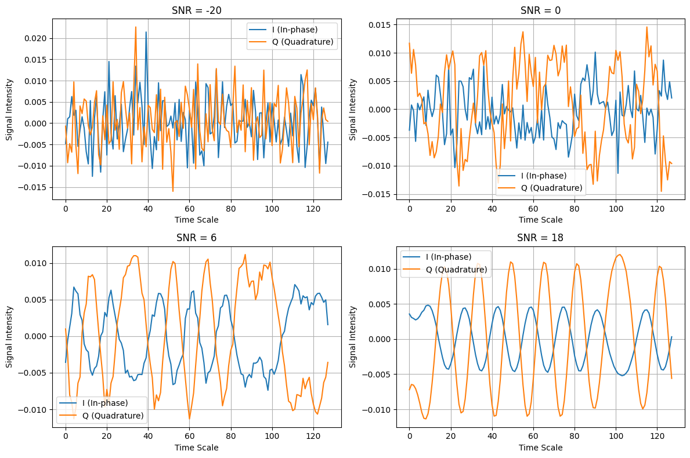
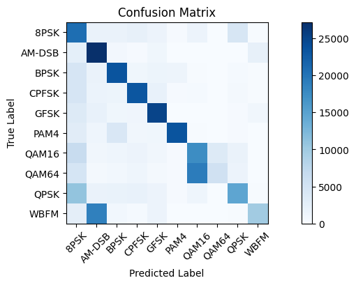
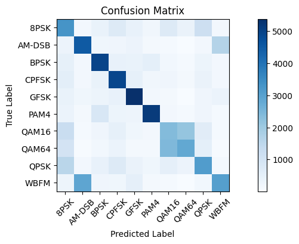
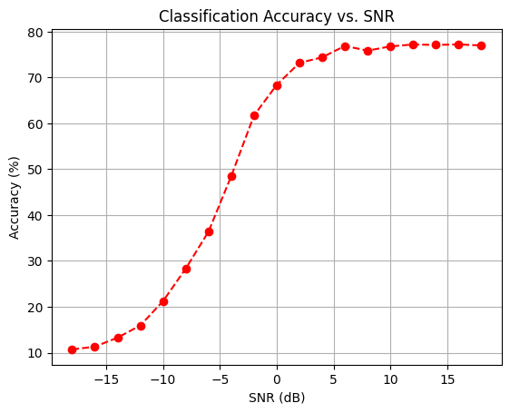
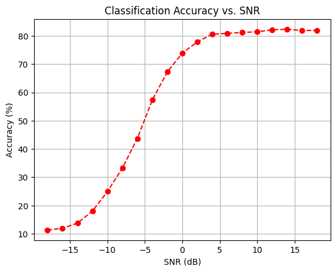
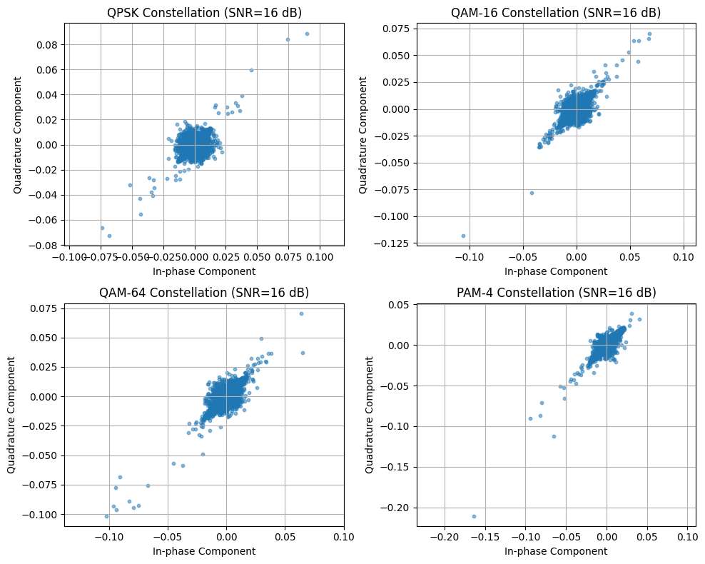
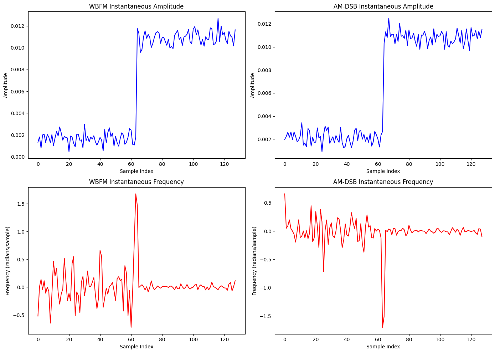
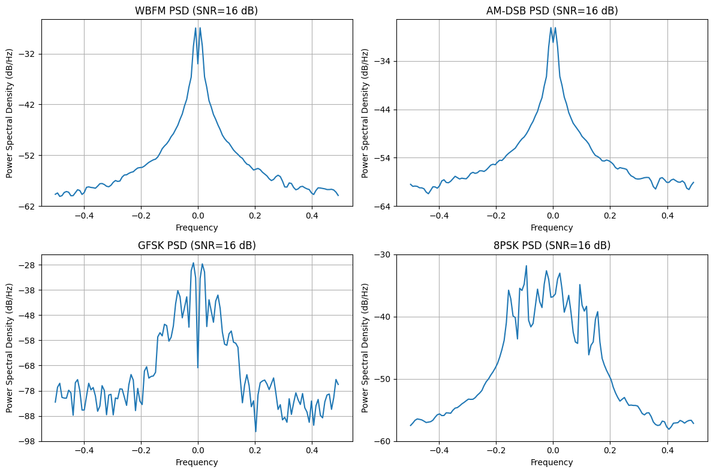

# **Improvised Modulation Classification with Feature Engineering and Federated Learning**

## **Overview**
This project demonstrates the use of **Convolutional Neural Networks (CNN)** for classifying wireless signal modulations with advanced **feature engineering**. It also implements **Federated Learning (FL)** to enable secure, distributed training.

---

## **Key Features**
- **Dataset**: RadioML dataset with in-phase (I) and quadrature (Q) signals across various modulation types and SNR levels.
   
- **Feature Engineering**:
  - Fast Fourier Transform (FFT) features for spectral information.
  - Derivative and integral features for signal dynamics.
  - Instantaneous amplitude and frequency for modulation-specific characteristics.
  - Constellation density for distinguishing complex modulation types like QAM-16 and QAM-64.
- **Deep Learning Architecture**:
  - 1D CNN with ReLU activation, batch normalization, and dropout for robust signal classification.
  - Trained using Adam optimizer and categorical cross-entropy loss.
- **Federated Learning (FL)**:
  - Distributed training across 10 simulated clients.
  - Privacy-preserving framework without sharing raw data.
  - Weight averaging for global model updates.

---

## **Getting Started**

### **Requirements**
- Python 3.8+
- Libraries: `numpy`, `pandas`, `tensorflow`, `matplotlib`, `scipy`, `sklearn`

Install dependencies using:
```bash
pip install -r requirements.txt
```

### **Dataset**
Download the **RadioML 2016.10a** dataset from [DeepSig](https://www.deepsig.io/datasets) and preprocess it into `modulation_data.pkl`.

---

## **Code Structure**

### **Preprocessing and Feature Engineering**
This section preprocesses the dataset and generates enhanced features like FFT, derivative, and integral signals.

### **Model**
A 1D Convolutional Neural Network (CNN) is built to classify the signal modulations. Key features include:
- Dropout for regularization.
- Batch normalization for faster convergence.
- Adam optimizer for efficient training.

### **Federated Learning**
A Federated Learning framework is implemented with simulated clients, demonstrating the privacy-preserving training mechanism.

---

## **Results**
1. **Initial Model**:
   - Struggled with noisy signals and complex modulations like QAM-64.
2. **Improved Model**:
   - Feature engineering enhanced classification accuracy significantly.
3. **Federated Learning**:
   - Achieved comparable accuracy while maintaining data privacy.

### **Figures**
To better understand the results, here are some key visualizations used in this project:

1. **Confusion Matrix without additional advanced features**:  
     
   This matrix helps in understanding which modulation types are most often misclassified.
   **After Feature Engineering**: 
     
   This matrix helps in understanding which modulation types are most often misclassified.
3. **SNR vs Accuracy Plot without additional advanced features**:  
     
   This plot shows how the model accuracy changes across different SNR levels, highlighting potential areas of improvement.
  **SNR vs Accuracy Plot without additional advanced features**:  
     
   This plot shows the improvement after feature engineering.
4. **Constellation Diagrams**:  
     
   Visual representation of constellation points for QAM16 and QAM64, which helps in differentiating complex modulation types.

5. **Instantaneous Features**:  
     
   Instantaneous frequency diagrams for modulation type AM-DSB.
   
7. **Power Spectrum Density**: 
   
   Power Spectrum Density for a BPSK signal.
---

## **Author**
**Atit Pokharel**  
Department of Electrical and Computer Engineering, University of Alabama in Huntsville, USA  
Email: [ap1284@uah.edu](mailto:ap1284@uah.edu)

---

## **References**
1. **Dataset**: [RadioML 2016.10a](https://www.deepsig.io/datasets).
2. **Federated Learning Framework**: Inspired by McMahan et al.'s *Communication-Efficient Learning of Deep Networks from Decentralized Data*.

---

## **Acknowledgments**
Special thanks to the Department of Electrical and Computer Engineering at UAH and Dr. Dinh Nguyen for resources and support.
